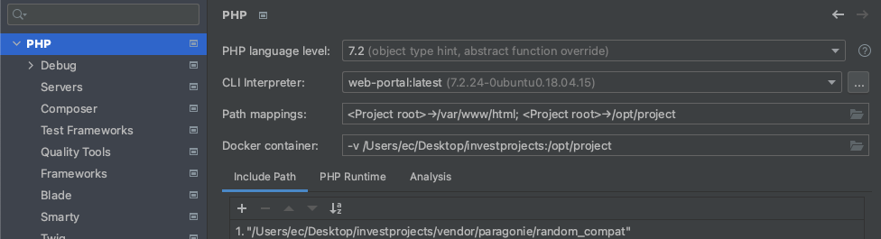
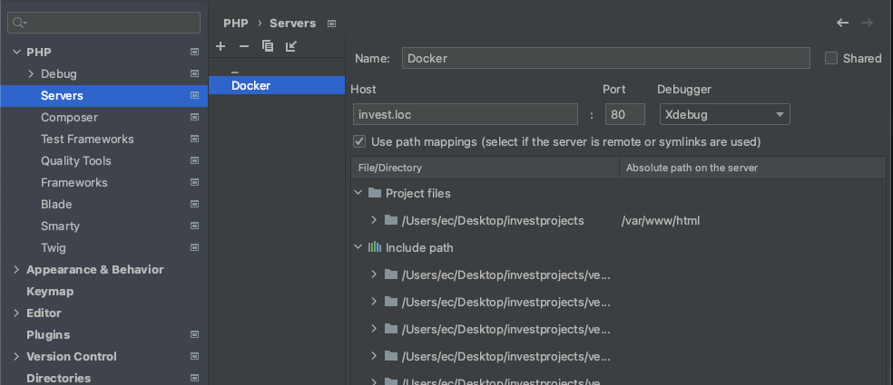
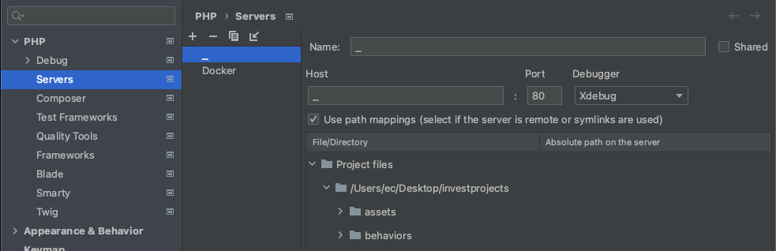
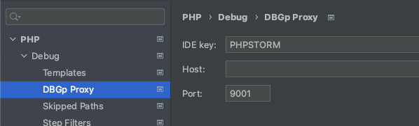
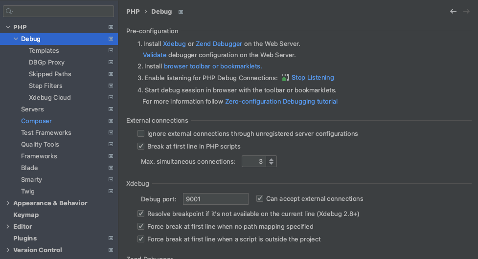
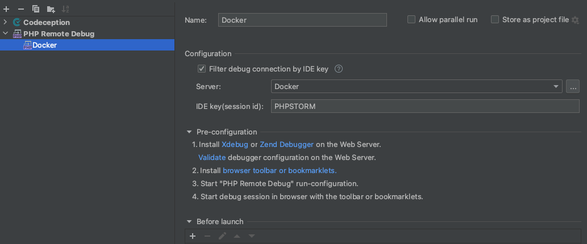

# Как настроить Xdebug для PhpStorm на маке с docker

### Установи докер, и шторм, и мак купи.

1. `docker-compose.yml` будет такой. 

```
version: '3.8'
   services:
   portal:
   build: ./ubuntu/
   container_name: web
   restart: always
   ports:
        - "80:80"
        - "9001:9001"
   environment:
        - COMPOSER_MEMORY_LIMIT=-1
        - PHP_IDE_CONFIG= "serverName=Docker"
   volumes:
        - /Users/ec/Desktop/investprojects:/var/www/html
```
2. `DOCKERFILE` файл такой. Наверное может быть и другой, но у меня такой. Порты смотри чтоб как выше были!

```
FROM ubuntu:18.04

ENV DEBIAN_FRONTEND=noninteractive

RUN apt-get update
RUN apt-get install -y software-properties-common
RUN apt-get install -y mc nano curl nginx php php-fpm php-common php-mysql php-gd php-cli php-curl php-json php-cgi php-gd php-zip php-mbstring php-xml php-xmlrpc php-intl php-xdebug php-imap
RUN apt-get purge -y apache2

COPY ./default /etc/nginx/sites-available/
COPY ./php.ini /etc/php/7.2/fpm
COPY ./xdebug.ini /etc/php/7.2/mods-available/

RUN useradd -G www-data,root -u 501 -d /home/ec ec
RUN ln -s /var/www/html/yii /usr/bin/yii

CMD service php7.2-fpm start && nginx -g "daemon off;"

EXPOSE 80
EXPOSE 9001
```
3. еще нужны настройки xDebug, они вот такие:
```
zend_extension=xdebug.so
xdebug.mode=develop,debug
xdebug.remote_enable=1
xdebug.remote_host=host.docker.internal
xdebug.remote_port=9001
xdebug.remote_autostart=on
xdebug.idekey="PHPSTORM"
```
4. Еще не забудь поставить в броузер расширение с зеленым жуком Xdebug helper. с ним удобней. без него не пробовал, но там что-то в адресную строку самому добавлять нужно, так не круто
5. Дальше нужно уже идти в phpStorm настраивать `cmd + ,` -> 

6. 
6. 
6. 
6. 
6. 